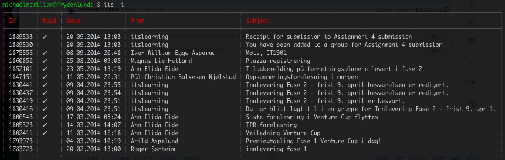

# ItsLearningCLI
This is a command line tool that aims to replace the most noodle-bending counter-intuitive
application ever made: [ItsLearning.com](http://itslearning.com).

## Screenshots
##### Messages in the inbox


Check the [screens](screens/) directory for more.

## Installation
[](https://nodei.co/npm/itslearningcli)

## Usage
```
Usage:
  its [OPTIONS] [ARGS]

Options:
  -s, --setup            Setup credentials and driver.
  -n, --notifications    List notifications.
  -i, --inbox            List messages in your inbox.
  -c, --courses          List all courses with their corresponding id.
  -b, --bulletins NUMBER List bulletings (news) for a single course id.
  -t, --tree NUMBER      List directories and files for a single course.
  -h, --help             Display help and usage details
```
## Contributors
- @michaelmcmillan <email@michaelmcmillan.net> came up with the idea the initial code.
- @marthall fixed bugs, missing documentation and corrected package.json dependencies.
- @roessland helped with reporting a silent error
- @RasmusWriedtLarsen feature-suggestions

## Contributing
It'sLearning supports several ways of authentication. For instance, the
NTNU (Norwegian University of Science and Technology) uses SAML (Security
Assertion Markup Language) while others only use the "native" It'sLearning
login.

This is why itslearningcli ships with a directory called <code>drivers</code>.
If you want to login to It'sLearning with itslearningcli there has to be a compatible
driver for your school. Unfortunately I don't have the rights to log into schools
I'm not studying at, therefore I need help writing drivers.

A pull-request is greatly appreciated and I'll make sure to credit anyone who
helps out.
